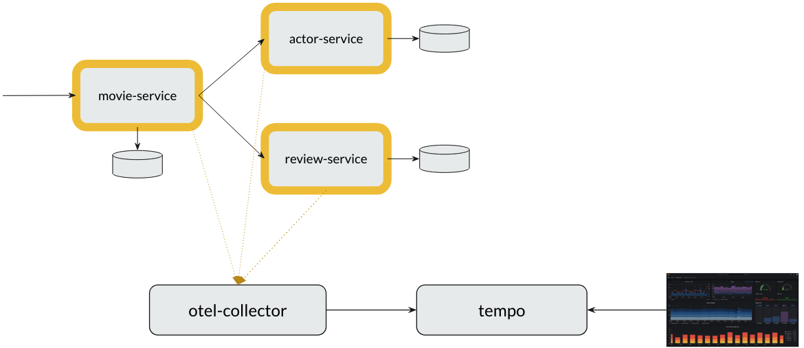
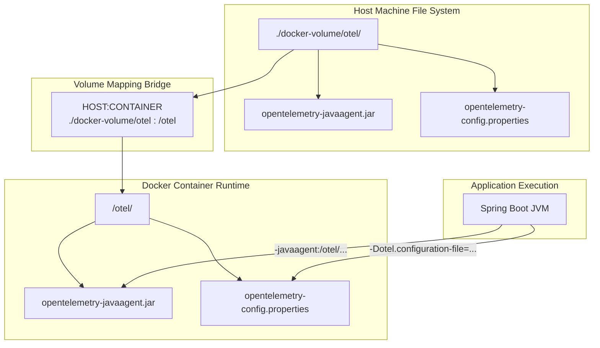
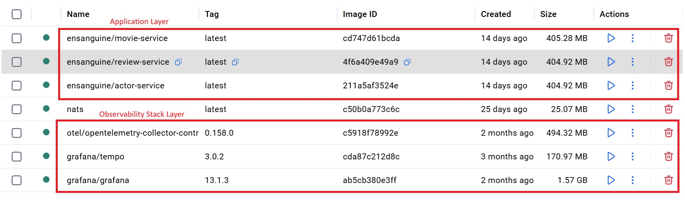

# Distributed Tracing Demo with OpenTelemetry, Tempo & Grafana

This demo shows how **distributed tracing** works in a microservices architecture using **OpenTelemetry**, **Tempo**, and **Grafana**.

## Project Setup



We have 3 microservices:

- **movie-service** → entry point for clients (exposed on port `8080`)
- **actor-service** → returns actor details
- **review-service** → returns movie reviews

Supporting components:

- **otel-collector** → collects telemetry data (traces) from services and exports them
  - Exposes port `4317` (gRPC) and `4318` (HTTP) for services to send telemetry data
  - Forwards traces to Tempo
  - [Config via collector-config.yaml](config-otel.md)

- **tempo** → backend store for trace data
  - Receives trace data from the collector on ports `4317` (gRPC) or `4318` (HTTP)
  - Exposes port `3200` for Grafana to query traces
  - [Config via tempo.yaml](config-tempo.md)

- **grafana** → UI to query and visualize traces
  - Exposes port `3000` for the web UI
  - Pre-configured to use Tempo as a data source
  - [Config via grafana-datasources.yaml](config-grafana.md)

> **Note:** This setup is for **learning and demos only**.  
> As Java developers, we are usually **not expected** to set up observability infrastructure in production.  
> In real-world projects, DevOps/SRE teams typically deploy and manage these components (Tempo, Grafana, OpenTelemetry Collector, etc.) using tools like **Helm charts** and Kubernetes.  
> For this demo, we use **Docker Compose** to simplify the setup and focus on learning how to instrument and observe applications.

## Prerequisite

- Make sure Docker has sufficient resources allocated.
  - At least **4 CPUs** and **8 GB RAM** are recommended.
- Ensure that you have built these docker images.

```
ensanguine/movie-service
ensanguine/actor-service
ensanguine/review-service
```

## Startup

- Start everything. Wait for 30 seconds and ensure that all the containers are up and running.

```bash
docker compose up
```

- Access Grafana: [http://localhost:3000](http://localhost:3000)
  - username: `admin`
  - password: `admin`

## Configure docker-compose.yaml

- Click [here](docker-compose.md) for configuration details.

## Volume Mapping

Docker Compose relies on volume mapping to link a directory on the host machine to a directory inside a Docker container. This bind mount is used for configuration files and code hot-reloading. It allows the mounting of specific files or folders from the project directory into the container so we can edit them locally.



- Host Disk (Top): The physical files reside in the project directory (`./docker-volume/otel/`).

- Volume Bridge (Middle): Docker Compose binds the host path to the container path (`./docker-volume/otel:/otel`).

- Container Mount (Lower Middle): Inside the container, Linux sees a virtual directory (`/otel/`) containing the exact same files.

- App Runtime (Bottom): Your Spring Boot JVM boots up and loads the OpenTelemetry Java Agent from `/otel/opentelemetry-javaagent.jar`.

- Any change made to files inside the host folder instantly reflects inside the container's mapped folder, and vice versa.

## Docker Images

After running `docker compose up`, 6 docker images will be created, forming the application layer, and the observaility stack layer.



- `movie-service`, `review-service` and `actor-service` forms the application layer.

- `opentelemetry-collector-contrib` is the central telemetry node that accepts OTLP traces from the application layer.

- `tempo` is trace storage backend.

- `grafana` is the visual dashboard frontend.

## Demo

Click [here](distributed-tracing.md) for the demo walkthrough.
