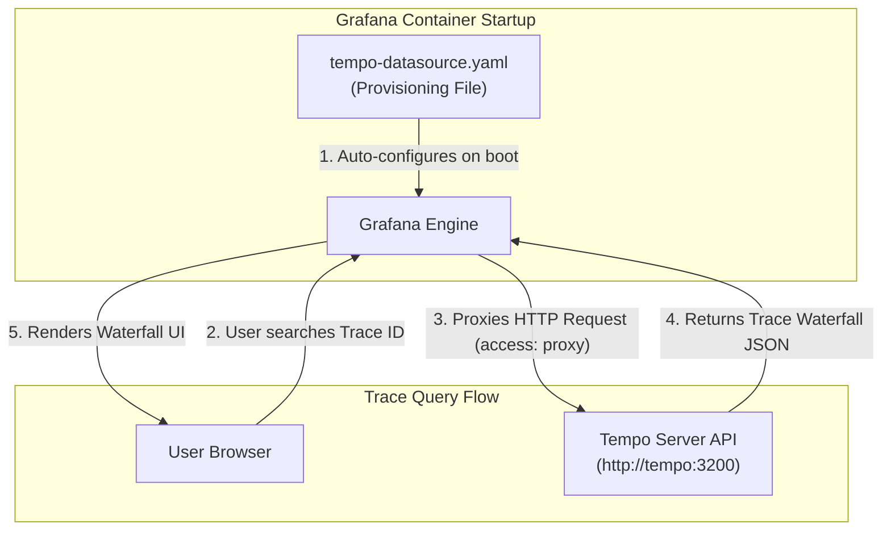

# Configuration of Grafana Datasource (grafana-datasources.yaml)

Instead of manually adding Tempo through the Grafana UI after starting the containers, this configuration automatically registers Tempo as a queryable datasource inside Grafana as soon as the Grafana container boots up.

Here is a breakdown of what each field does:

## 1. Configuration Metadata

```yaml
apiVersion: 1

datasources:
  - ...
```

apiVersion: 1: Specifies the configuration format version that Grafana expects for datasource provisioning.

datasources:: Declares the list of datasources to be automatically loaded on startup.

## 2. Datasource Settings

```yaml
datasources:
  - name: tempo
    uid: tempo_ds
    type: tempo
    access: proxy
    url: http://tempo:3200
```

name: tempo: The display name for this datasource inside the Grafana UI (e.g., in the dropdown menu when querying traces in Grafana Explore).

uid: tempo_ds: A unique ID for this datasource. Setting a fixed UID (tempo_ds) allows you to hardcode trace links between Loki logs or Prometheus metrics and Tempo in pre-built Grafana dashboards.

type: tempo: Tells Grafana to use its built-in Tempo plugin to query and render trace waterfalls.

access: proxy: Configures Grafana’s backend server to act as a proxy when querying Tempo:

proxy (Recommended for Docker): The Grafana container makes backend-to-backend HTTP calls directly to http://tempo:3200 across the internal Docker network. Your web browser doesn't need direct access to port 3200.

direct: Your browser directly attempts to hit Tempo's URL, which fails inside Docker unless port 3200 is mapped to your host machine.

url: http://tempo:3200: The internal network URL Grafana uses to query Tempo's HTTP API (using Docker Compose DNS resolution to reach the tempo container on port 3200).


