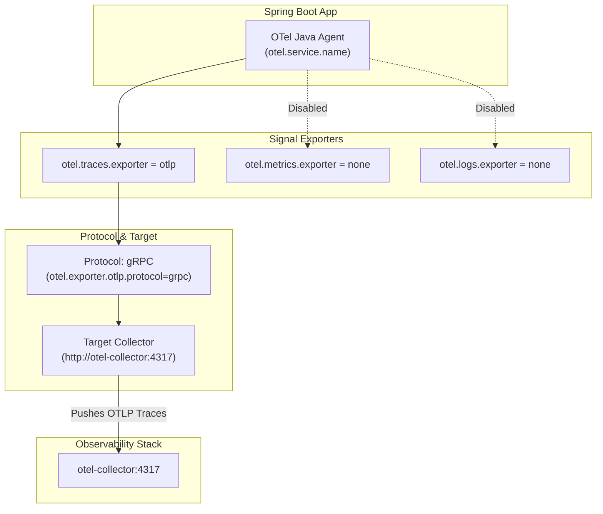

# Configuration of Java agent (./otel/opentelemetry-config.properties)

This properties file configures the OpenTelemetry Java Agent (or SDK) by defining how telemetry data is gathered and exported from the Spring Boot application.

Here is a breakdown of what each setting does:

## 1. Service Identification

```properties
otel.service.name=my-service-we-override-via-command-line-options:
```

Sets the default logical service name for all reported telemetry. This acts as a fallback identifier in your tracing backend (like Tempo or Jaeger). As the key name suggests, you can override this per service on startup using JVM flags (e.g. `-Dotel.service.name=movie-service`).

## 2. Signal Exporter Toggles (Traces Only)

`otel.traces.exporter=otlp`:

Enables distributed tracing and sets the export protocol to OpenTelemetry Protocol (OTLP).

`otel.metrics.exporter=none`:

Disables OpenTelemetry metric collection and export.

`otel.logs.exporter=none`:

Disables OpenTelemetry log collection and export.

> Why do this? In the current setup, we are focusing strictly on distributed tracing. Disabling unused metrics and logs reduces CPU and network overhead for the container.

## 3. Exporter Protocol & Endpoint Destination

`otel.exporter.otlp.protocol=grpc`:

Configures the agent to transmit trace data using high-performance binary gRPC rather than HTTP/JSON.

`otel.exporter.otlp.endpoint=http://otel-collector:4317`:

Directs the agent to send the OTLP trace data to the service named `otel-collector` on port 4317 (matching the gRPC receiver port defined in your otel-collector container).

When the configuration file (`opentelemetry-config.properties`) is loaded by the microservices, the telemetry flow operates as follows:


