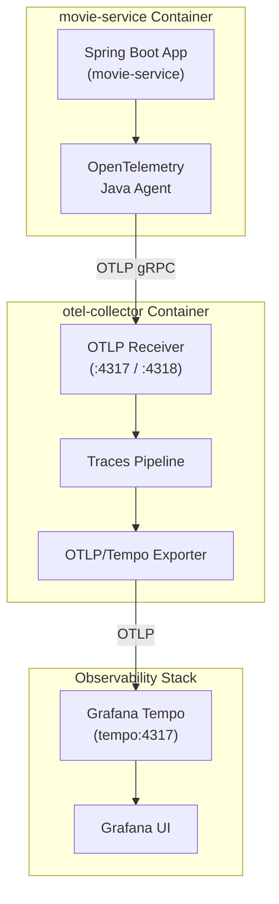

# Configuration of the OpenTelemetry (OTL) Collector (collector-config.yaml)

Instead of the Spring Boot microservices sending traces directly to Grafana Tempo, they send traces to this Collector, which receives them and forwards them to Tempo.

Here is a breakdown of the three main components in this YAML:

## 1. receivers (where data enters the Collector)

```yaml
receivers:
  otlp:
    protocols:
      grpc:
        endpoint: ":4317"
      http:
        endpoint: ":4318"
```

This configures the Collector to accept telemetry data using the standard OTLP (OpenTelemetry Protocol) on two standard network ports:

Port 4317 (gRPC): High-performance binary transport (typically used by the Java agent).

Port 4318 (HTTP): Standard HTTP/JSON transport.

The :4317 notation means it listens on all network interfaces inside its container on port 4317.

## 2. exporters (where the data goes next)

```yaml
exporters:
  otlp/tempo:
    endpoint: "tempo:4317"
    tls:
      insecure: true
```

This defines where the Collector should push the received trace data:

otlp/tempo: An exporter instance named otlp/tempo.

endpoint: "tempo:4317": Tells the Collector to forward the traces to a service named tempo on port 4317 (using Docker Compose DNS resolution to locate the tempo container).

tls.insecure: true: Disables TLS/SSL encryption because communication happens over an isolated, trusted internal Docker network.

## 3. service.pipelines (connecting receivers to exporters)

```yaml
service:
  pipelines:
    traces:
      receivers: [otlp]
      exporters: [otlp/tempo]
```

This wires the pipeline together for traces:

Take incoming trace data from the otlp receiver (ports 4317/4318).

Forward that data directly to the otlp/tempo exporter (tempo:4317).


