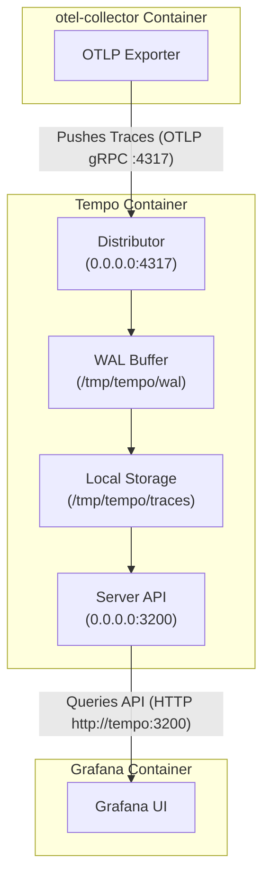

# Configuration of Grafana Tempo (tempo.yaml)

This is the configuration file for Grafana Tempo. It defines how Tempo receives traces from the collector, stores them locally, and exposes an HTTP API for Grafana to query.

Here is a breakdown of what each section does:

## 1. server (Tempo Management and Query API)

```yaml
server:
  http_listen_address: 0.0.0.0
  http_listen_port: 3200
```

- http_listen_address: 0.0.0.0: Listens for network requests on all available container network interfaces.

- http_listen_port: 3200: Exposes Tempo's internal HTTP API on port 3200. This is the port Grafana connects to when you configure Tempo as a datasource in Grafana (http://tempo:3200).

## 2. distributor (Ingesting Traces)

```yaml
distributor:
  receivers:
    otlp:
      protocols:
        grpc:
          endpoint: "0.0.0.0:4317"
        http:
          endpoint: "0.0.0.0:4318"
```

- The distributor is Tempo's entry point for receiving trace data.

- otlp.protocols: Configures Tempo to directly accept standard OpenTelemetry (OTLP) traces.

- grpc (4317): Matches the tempo:4317 endpoint that the otel-collector forwards traces to.

## 3. storage (Where Traces are Saved)

```yaml
storage:
  trace:
    backend: local
    local:
      path: /tmp/tempo/traces
    wal:
      path: /tmp/tempo/wal
```

- backend: local: Uses the container's local disk filesystem instead of an external cloud storage bucket like AWS S3 or MinIO. Perfect for local development in Docker Compose.

- wal (Write-Ahead Log): Tempo first writes incoming traces to /tmp/tempo/wal in memory/disk buffer to prevent data loss during unexpected crashes.

- local.path: Once trace blocks are compressed, Tempo moves them to /tmp/tempo/traces for long-term storage and querying.

> Because /tmp/tempo/traces lives inside the container's temporary filesystem, trace data will reset if the Tempo container is deleted. If you want traces to persist across Docker restarts, map a named volume or local folder in docker-compose.yaml to /tmp/tempo.



Pushing Traces (Collector $\rightarrow$ Tempo):

- The otel-collector initiates an outbound connection to Tempo on gRPC port 4317 to push span data into storage.

Querying Traces (Grafana $\rightarrow$ Tempo):

- Grafana acts as the client/frontend. When you search for a trace ID or open a dashboard, Grafana sends an HTTP request (GET /api/traces/...) to Tempo on port 3200. Tempo processes the query and returns the matching JSON trace back to Grafana.
