# Distributed Tracing Demo

Login to the Grafana dashboard using credentials `admin`/`admin`.

Click on the hamburger menu at the left right corner to bring out the main menu.

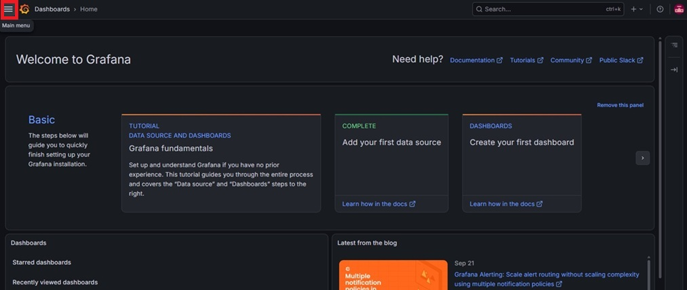

Select the `Explore` menu item.

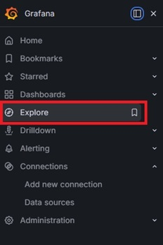

The `Explore` page has a `Tempo` data source which came from the [grafana-datasources.yaml](config-grafana.md) config file.

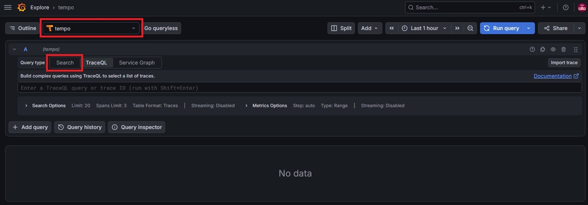

Click on the `Search` Query Type, this brings up a list of traces related to the initialization of the 3 application services.

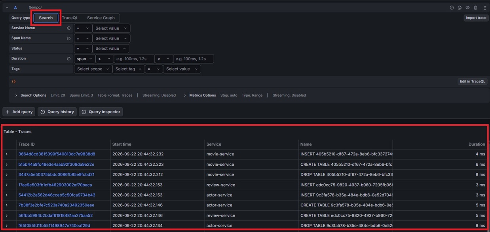

Call the get movie by id API endpoint (http://localhost:8080/api/movies/:id) using postman.

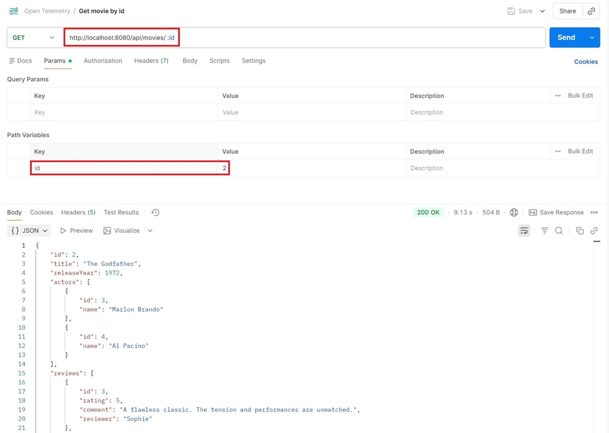

Click on the `Run Query` button to refresh the list of traces. We can find the latest trace generated by the get movie API call.

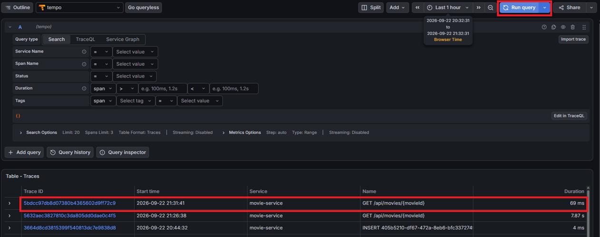

Click on the trace ID to bring up the trace details panel. From the trace panel, you can see from which application service did the trace originate from, the route of the API call, the number of application services involved and the entire lifecycle of the API call in traces.

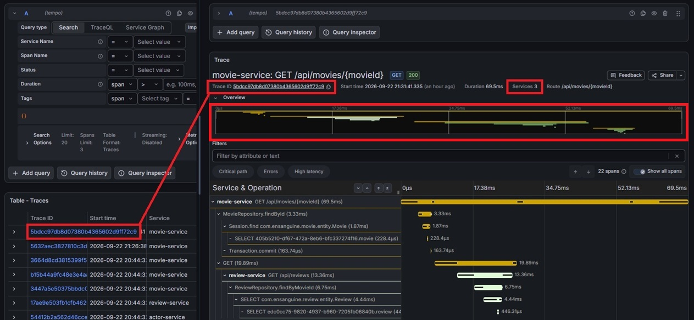

In the `Service & Operation` section, we can see that an initial call to the `/api/movies/{movieId}` `GET` endpoint, contains 3 other APIs calls (1 to `review-service`, 2 to `actor-service`).

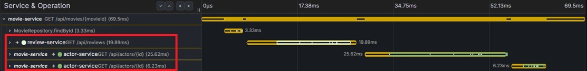

From the expanded trace flow for `review-service` `GET` `/api/reviews`, you can see a 3-layer execution hierarchy for this database lookup:

1. `ReviewRepository.findByMovieId`: This is the high-level Spring Data JPA repository method invoked by Java code.

2. `SELECT com.ensanguine.review.entity.Review`: This is Hibernate processing the JPA query, converting the Java entity target into SQL statements, and mapping the returned rows back into Java `Review` objects.

3. `SELECT edc0cc75...review`: This is the actual JDBC driver level call executing the raw SQL against the database.

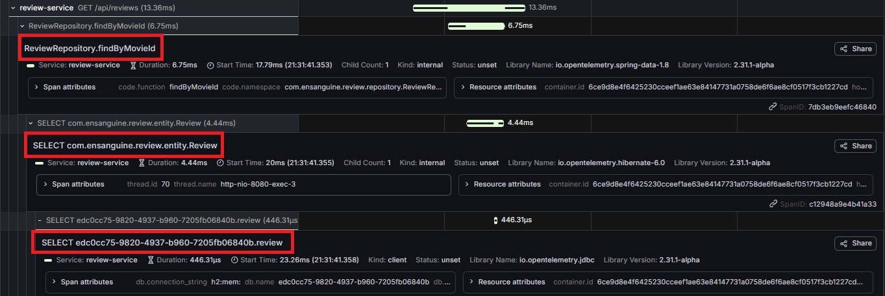

Click on `Span attributes` reveals additional details related to the span. For example, clicking on the database level span attributes, shows the SQL statement executed against the H2 database.

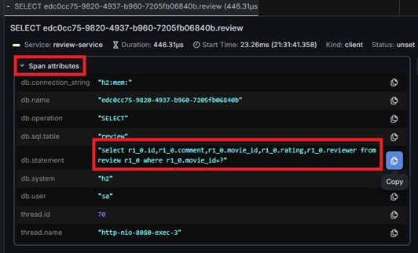

We have just demonstrated how to use Grafana Explore to gather granular visual insights, making it easy to identify hidden microservice latency (e.g. database overhead or downstream API dependencies) within seconds.

## Troubleshooting using Distributed Tracing

Now lets simulate a 500 Internal Server Error and see how we can trace it using the observability stack setup here. Make a API call to the same get movie by ID endpoint, this time using `id = 10` (http://localhost:8080/api/movies/10)

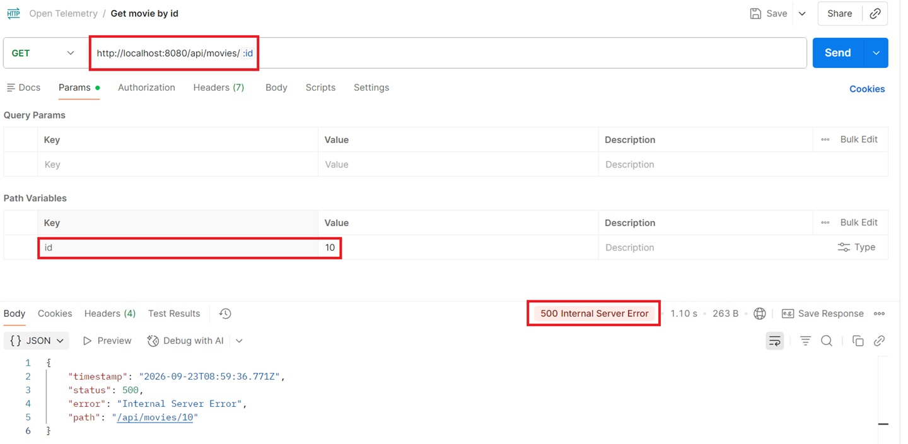

In `Garfana Explore`, click on the trace ID to bring up the trace details panel in a new browser tab.

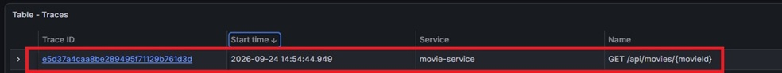

In the trace details panel, Service & Operation section, we can tell that there is an issue with the API call with the red icon.

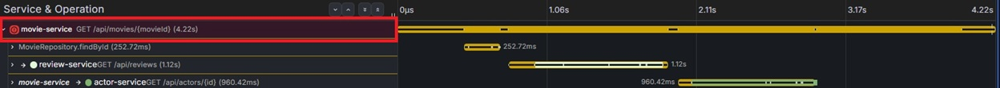

Click on the `movie-service GET /api/movies/{movieId}` to drill into the details. From the details, we can tell that the API is returning a 500 server error status, it contains 4 child spans, and it has one event.

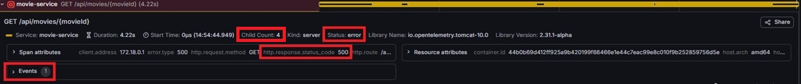

Click on the `Span attributes` drop down and we can verify the url path (`/api/movies`) and path variable (`10`) that caused the 500 server error.

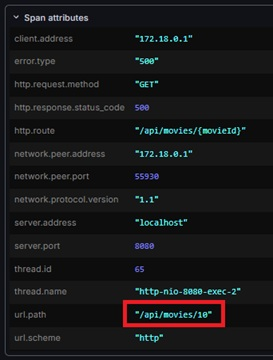

Click on the `Events` drop down we now know that underlying the 500 server error is actually a 404 Not Found error. The `GET` movie API call makes further calls to the `review-service` and the `actor-service`. Probably one of these calls failed and caused the error.

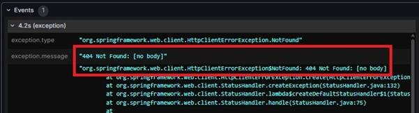

Investigating deeper into the stack trace, we can confirm that the 404 error is coming from the `actor-service`.

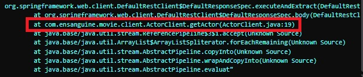

Going back to the `Service & Operation` section, we can see that indeed there is a problem with the API call with the `actor-service`.

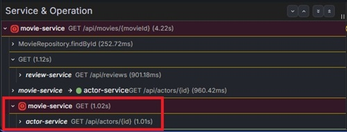

Drilling into the `Span attributes`, we can confirm that it is a 404 Not Found error and the url path is `/api/actors/20`. The developers can then investigate the reasons behind why actor entity with `id = 20` is missing.

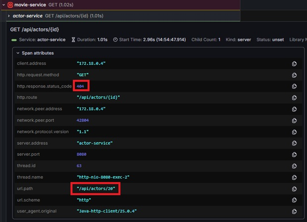

Here, we have demonstrated how we can troubleshoot an API erorr using distributed tracing across multiple services.
