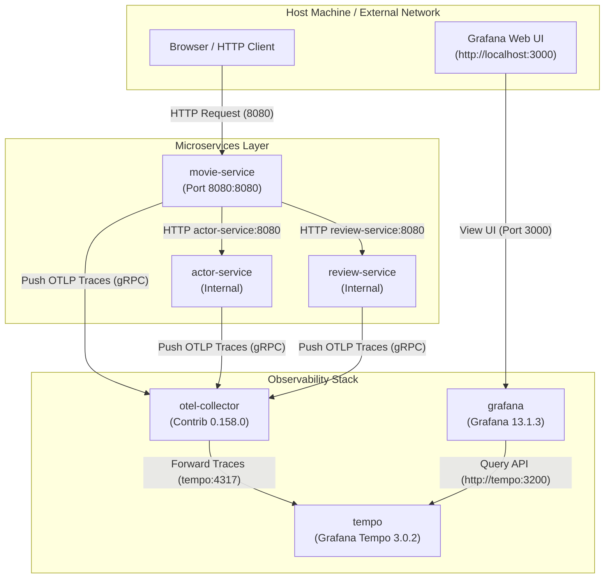

# Configuration of Docker Compose (docker-compose.yaml)

The `docker-compose.yaml` orchestrates the entire Trace-Flix distributed microservices architecture along with its complete OpenTelemetry observability pipeline.

It provisions 6 containers divided into two main layers: the application microservices and the observability infrastructure.

## 1. Application Layer (movie-service, actor-service, review-service)

```yaml
movie-service:
  image: ensanguine/movie-service
  container_name: movie-service
  volumes:
    - ./docker-volume/otel:/otel
  command: >
    java
    -javaagent:/otel/opentelemetry-javaagent.jar
    -Dotel.javaagent.configuration-file=/otel/opentelemetry-config.properties
    -Dotel.service.name=movie-service  
    -jar /app/app.jar
  depends_on:
    - otel-collector
  environment:
    "actor-service.url": "http://actor-service:8080/api/actors/"
    "review-service.url": "http://review-service:8080/api/reviews"
  ports:
    - "8080:8080"
```

All three Spring Boot microservices follow a unified execution pattern:

- OpenTelemetry Java Agent Integration:
  - Each service mounts `./docker-volume/otel` into `/otel`.

  - Upon startup, the JVM attaches `-javaagent:/otel/opentelemetry-javaagent.jar` using `-Dotel.javaagent.configuration-file=/otel/opentelemetry-config.properties`. This automatically intercepts inbound/outbound HTTP calls to generate distributed trace spans.

  - `opentelemetry-javaagent.jar` can be downloaded from [here](`github.com/open-telemetry/opentelemetry-java-instrumentation/releases`).

  - Save the downloaded file into the project's `./docker-volume/otel/` folder so it matches the `docker-compose.yaml` volume mapping (`./docker-volume/otel:/otel`).

  - Configuration of the Java agent can be done via a `properties` file. For details, refer to [this](config-java-agent.md).

- Service Identification:
  - `- Dotel.service.name` tags telemetry data distinctly for each service (movie-service, actor-service, review-service).

- Inter-Service Communication:
  - `movie-service` receives environmental URLs pointing to `actor-service:8080` and `review-service:8080`, allowing them to communicate across Docker's internal virtual network.

- Public Entrypoint:
  - Only movie-service exposes `port 8080:8080` to your host machine, making it the primary gateway for incoming requests.

## 2. Observability Stack Layer (otel-collector, tempo, grafana)

This layer handles trace collection, storage, and visualization:

- otel-collector (image: `otel/opentelemetry-collector-contrib`):
  - Serves as the central telemetry router.
  - Ingests OTLP traces pushed from the Java Agents in `movie-service`, `actor-service`, and `review-service` over gRPC/HTTP (:4317 / :4318).
  - Mounts `./docker-volume/collector-config.yaml` to route those traces downstream.
  - For details on configuration, click [here](config-otel.md)

- tempo (`grafana/tempo`):
  - Serves as the high-performance trace storage backend.
  - Receives forwarded traces from otel-collector on gRPC port 4317 and stores them according to `./docker-volume/tempo.yaml`.
  - For details on configuration, click [here](config-tempo.md)

- grafana (`grafana/grafana`):
  - Serves as the visual dashboard frontend.
  - Exposes port 3000:3000 so you can log in at http://localhost:3000 (credentials: admin/admin).
  - Pre-configures Tempo as a queryable datasource via the mounted `./docker-volume/grafana-datasources.yaml` file.
  - For details on configuration, click [here](config-grafana.md)


